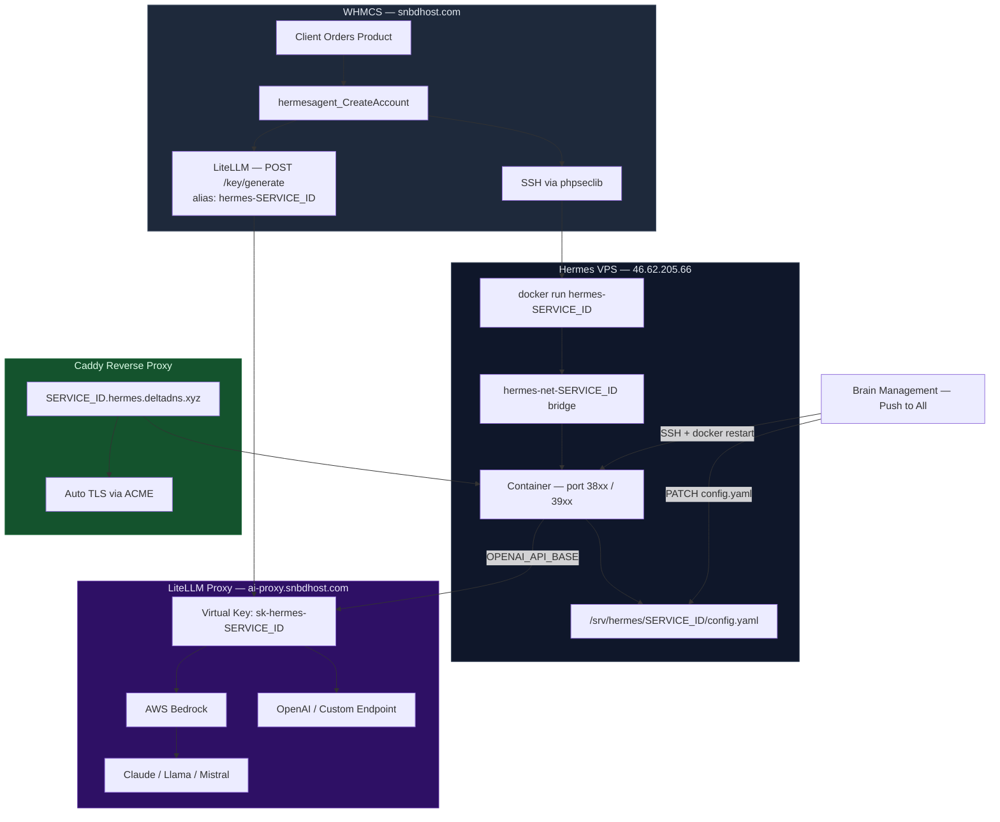

<div align="center">


<br/>

[](https://php.net)
[](https://whmcs.com)
[](https://docker.com)
[](https://litellm.ai)
[](https://aws.amazon.com/bedrock/)
[](https://caddyserver.com)
[](LICENSE)

<br/>

**HermesAgent** is a production-grade WHMCS server + addon module that spins up fully isolated AI agent containers on any VPS in seconds — complete with automatic SSL, per-customer token tracking, and a centralized Brain Management panel to push model changes to every live container at once.

<br/>

</div>

---

## ⚡ What is HermesAgent?

> Sell hosted AI agents as a product. Your customers get a private, branded agent dashboard at `{id}.hermes.yourdomain.xyz`. You control which LLM powers it — and can switch every agent in one click.

Every provisioned service gets:
- A **Docker container** with resource limits and full network isolation
- An **automatic SSL domain** via Caddy ACME (`{id}.hermes.yourdomain.xyz`)
- A **LiteLLM virtual key** (`hermes-{id}`) for individual token & spend tracking
- A **WHMCS lifecycle** — create, suspend, unsuspend, terminate all wired up

---

## ✨ Feature Overview

<table>
<tr>
<td width="50%">

### 🧠 Brain Management
Switch the AI model powering all containers from a single admin panel. Push the new model to every live container simultaneously — no SSH needed.

</td>
<td width="50%">

### 🔐 Customer Isolation
Each container runs in its own Docker network (`hermes-net-{id}`) with `--cap-drop ALL`, `--no-new-privileges`, and strict PID + memory limits.

</td>
</tr>
<tr>
<td width="50%">

### 📊 Token Tracking
Per-container LiteLLM virtual keys appear in the Customer Usage dashboard. See total tokens, prompt/completion split, and USD spend per agent — live.

</td>
<td width="50%">

### 🌐 Auto-SSL Domains
Caddy provisions a TLS certificate for every new container automatically. Domains are live within seconds of provisioning.

</td>
</tr>
<tr>
<td width="50%">

### 🔄 Full WHMCS Lifecycle
Create, suspend, unsuspend, and terminate all trigger the right Docker + LiteLLM actions. Suspending a container disables its API key too.

</td>
<td width="50%">

### 🤖 Multi-Model Support
Route traffic through AWS Bedrock (Claude, Llama, Mistral) or any OpenAI-compatible endpoint. Model per-container is tracked in the DB.

</td>
</tr>
</table>

---

## 🏗️ Architecture



---

## 🧩 Stack

| Layer | Technology | Purpose |
|-------|-----------|---------|
| **Billing & Provisioning** | WHMCS 8.x | Order management, lifecycle hooks |
| **Provisioning Transport** | phpseclib 3.x | SSH from WHMCS → VPS |
| **Container Runtime** | Docker | Per-customer isolated AI agents |
| **Reverse Proxy + TLS** | Caddy | Auto-SSL, domain routing |
| **LLM Gateway** | LiteLLM v1.93+ | Model routing, virtual keys, spend tracking |
| **LLM Backend** | AWS Bedrock | Claude 3.5, Llama 3.2, Mistral 7B |
| **Database** | MySQL (WHMCS) + PostgreSQL (LiteLLM) | State, keys, usage |
| **Agent UI** | Hermes Dashboard (Python) | Customer-facing agent interface |

---

## 🚀 Quick Start

### 1. Prepare the Hermes VPS

Run the setup script on your VPS to install Docker and generate SSH credentials for WHMCS:

```bash
curl -fsSL https://raw.githubusercontent.com/yeaminlabs/hermes-agent-whmcs/main/setup-vps.sh | bash
```

Copy the **IP address**, **username**, and **Access Hash** (private key) printed at the end.

---

### 2. Install the WHMCS Modules

```bash
# Clone into your WHMCS root
cd /path/to/whmcs

git clone https://github.com/yeaminlabs/hermes-agent-whmcs.git /tmp/hermesagent

# Server module
cp -r /tmp/hermesagent/modules/servers/hermesagent  modules/servers/

# Addon module
cp -r /tmp/hermesagent/modules/addons/hermesagent   modules/addons/
```

---

### 3. Add the Server in WHMCS

1. Go to **Setup → Servers → Add New Server**
2. Set **Type** → `Hermes Agent`
3. Paste the **IP**, **username**, and **Access Hash** from step 1
4. Save — WHMCS will SSH-verify the connection

---

### 4. Deploy LiteLLM

```bash
cd litellm/
cp config.yaml.example config.yaml   # edit with your AWS credentials

docker compose up -d
```

> LiteLLM runs on port `4000`. Point the server module's `LiteLLM API URL` configurable option at it.

---

### 5. Activate the Addon

1. **Setup → Addon Modules → Hermes Agent Manager → Activate**
2. This creates the `mod_hermesagent_instances`, `mod_hermesagent_brain_config` tables and seeds the default AI endpoint.

---

## 🧠 Brain Management

The **Brain Management** panel (WHMCS Admin → Addons → Hermes Agent Manager) lets you:

| Action | What it does |
|--------|-------------|
| **Add Endpoint** | Register a new AI provider (LiteLLM proxy, Bedrock, OpenAI, custom) |
| **Set Active** | Switch the global active brain — new containers will use this model |
| **Push to All** | SSH into the VPS, patch `config.yaml` for every live container, restart them |
| **View Usage** | See token counts and USD spend per container, pulled live from LiteLLM |

```
Admin → Hermes Agent Manager
│
├── Brain Management
│   ├── 🟢 SNBD Proxy (zai.glm-5)          ← active
│   ├──    Claude 3.5 Haiku (Bedrock)
│   └──    Mistral Voxtral Mini
│
└── Deployments
    ├── hermes-10  │ Active  │ zai.glm-5  │ 12,450 tokens  │ $0.0023
    └── hermes-11  │ Active  │ zai.glm-5  │  3,100 tokens  │ $0.0007
```

---

## 📁 Repository Structure

```
hermesagent/
├── modules/
│   ├── servers/
│   │   └── hermesagent/
│   │       ├── hermesagent.php      ← provisioning logic (CreateAccount, Suspend, etc.)
│   │       ├── ajax.php             ← admin AJAX endpoints
│   │       └── templates/           ← client-area views
│   └── addons/
│       └── hermesagent/
│           └── hermesagent.php      ← admin panel (Brain Management, deployments, leads)
├── litellm/
│   └── config.yaml                  ← LiteLLM gateway config (models, routing, keys)
└── setup-vps.sh                     ← one-shot VPS provisioner
```

---

## 🔒 Security Model

<details>
<summary><b>Per-container isolation details</b></summary>

Every container is launched with:

```bash
docker run -d \
  --name hermes-{id} \
  --network hermes-net-{id} \          # isolated bridge — no cross-container traffic
  --cap-drop ALL \                      # drop all Linux capabilities
  --security-opt no-new-privileges \    # no privilege escalation
  --ipc=none \                          # no shared memory
  --pids-limit 100 \                    # fork bomb protection
  --memory 1g \
  --cpus 1.0 \
  ...
```

Each container's LiteLLM API key is scoped to:
- Its allowed **model list**
- A **max budget** cap (`$5.00` default)
- **TPM limit** (100k tokens/min) and **RPM limit** (60 req/min)

Keys are suspended automatically when the WHMCS service is suspended.

</details>

<details>
<summary><b>LiteLLM virtual key lifecycle</b></summary>

| WHMCS Event | LiteLLM Action |
|-------------|----------------|
| `CreateAccount` | `POST /key/generate` → `hermes-{id}` |
| `SuspendAccount` | `POST /key/update` → `blocked: true` |
| `UnsuspendAccount` | `POST /key/update` → `blocked: false` |
| `TerminateAccount` | `POST /key/delete` |

Keys are created with `user_id: "hermes-{id}"` so they appear as distinct customers in the LiteLLM Customer Usage dashboard.

</details>

---

## 🛣️ Roadmap

- [x] Auto-provision Docker containers via WHMCS
- [x] Per-customer network isolation
- [x] Caddy auto-SSL domain routing
- [x] LiteLLM virtual key per container
- [x] Brain Management panel (push model to all containers)
- [x] Token tracking + spend per container in admin
- [x] Customer Usage view in LiteLLM (user_id per key)
- [ ] Per-container disk quota enforcement
- [ ] Self-service model selector in client area
- [ ] Multi-VPS support (deploy across a fleet)
- [ ] Webhook notifications on container health change
- [ ] Prometheus metrics export

---

## 🤝 Contributing

This module is maintained by [SNBD Host](https://snbdhost.com). Pull requests welcome for bug fixes and improvements. For new features, open an issue first to discuss.

---

<div align="center">


**Built with ❤️ by [SNBD Host](https://snbdhost.com)**

*Hermes — the messenger god, delivering AI to your customers.*

</div>
