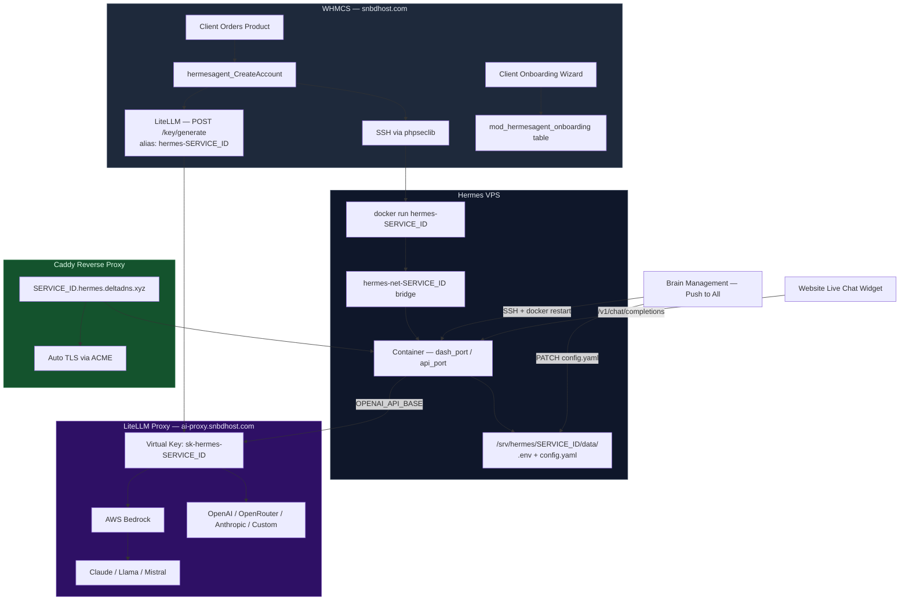

<div align="center">


<br/>

[](#changelog)
[](https://php.net)
[](https://whmcs.com)
[](https://docker.com)
[](https://litellm.ai)
[](https://aws.amazon.com/bedrock/)
[](https://caddyserver.com)
[](LICENSE)

<br/>

**HermesAgent** is a production-grade WHMCS server + addon module that spins up fully isolated AI agent containers on any VPS in seconds — complete with automatic SSL, per-customer token tracking, a client-facing onboarding wizard, a self-service LLM provider manager, and a centralized Brain Management panel to push model changes to every live container at once.

<br/>

</div>

---

## ⚡ What is HermesAgent?

> Sell hosted AI agents as a product. Your customers get a private, branded agent dashboard at `{id}.hermes.yourdomain.xyz`. You control which LLM powers it — and can switch every agent in one click.

HermesAgent wraps [Nous Research's Hermes](https://hermes-agent.nousresearch.com/) autonomous agent runtime into a fully billable, fully automated WHMCS hosting product. From the moment a customer checks out, everything is hands-free:

- A **Docker container** is provisioned on your VPS with resource limits and network isolation
- An **automatic SSL domain** is configured via Caddy ACME (`{id}.hermes.deltadns.xyz`)
- A **LiteLLM virtual key** (`hermes-{id}`) is created for individual token & spend tracking
- An **onboarding wizard** guides the new customer through naming and configuring their agent
- The full **WHMCS lifecycle** (create → suspend → unsuspend → terminate) triggers the exact right Docker + LiteLLM actions every time

---

## ✨ Feature Overview

<table>
<tr>
<td width="50%">

### 🧠 Brain Management
Switch the AI model powering all containers from a single admin panel. Push the new model to every live container simultaneously — no SSH needed.

</td>
<td width="50%">

### 🔐 Customer Isolation
Each container runs in its own Docker network (`hermes-net-{id}`) with `--cap-drop ALL`, `--no-new-privileges`, and strict PID + memory limits.

</td>
</tr>
<tr>
<td width="50%">

### 📊 Token Tracking
Per-container LiteLLM virtual keys appear in the Customer Usage dashboard. See total tokens, prompt/completion split, and USD spend per agent — live.

</td>
<td width="50%">

### 🌐 Auto-SSL Domains
Caddy provisions a TLS certificate for every new container automatically. Domains are live within seconds of provisioning.

</td>
</tr>
<tr>
<td width="50%">

### 🔄 Full WHMCS Lifecycle
Create, suspend, unsuspend, terminate, change password, and change package all trigger the right Docker + LiteLLM actions. Suspending a container disables its API key too.

</td>
<td width="50%">

### 🤖 Multi-Model & Multi-Provider Support
Route traffic through AWS Bedrock (Claude, Llama, Mistral), OpenRouter, OpenAI, Anthropic, Nous Portal, or any custom OpenAI-compatible endpoint.

</td>
</tr>
<tr>
<td width="50%">

### 🧙 Customer Onboarding Wizard
A beautiful, multi-step in-WHMCS onboarding flow lets new customers name their agent, pick a use case, set a tone, and write custom instructions — all before their container is first configured.

</td>
<td width="50%">

### 💬 Messaging Platform Bridges
Customers can connect their agent to **Telegram**, **Discord**, or **Slack** with just a bot token — configured from the client area, zero server restarts.

</td>
</tr>
<tr>
<td width="50%">

### 🌐 Website Live Chat Widget
Clients get a ready-to-paste `<script>` snippet that embeds a floating AI chat bubble on any website, powered directly by their Hermes container's OpenAI-compatible API.

</td>
<td width="50%">

### 📋 Lead Generation CRM
A standalone PHP quiz endpoint (`hermes-quiz-submit.php`) captures pre-purchase leads directly into a WHMCS-adjacent table. The addon ships a full CRM view with export.

</td>
</tr>
</table>

---

## 🏗️ Architecture



---

## 🧩 Technology Stack

| Layer | Technology | Purpose |
|-------|-----------|---------|
| **Billing & Provisioning** | WHMCS 8.x | Order management, lifecycle hooks, client area |
| **Provisioning Transport** | phpseclib 1/2/3 (auto-detected) | SSH from WHMCS → VPS for all container commands |
| **Container Runtime** | Docker | Per-customer isolated AI agent containers |
| **Reverse Proxy + TLS** | Caddy | Auto-SSL via ACME, subdomain routing |
| **LLM Gateway** | LiteLLM v1.93+ | Model routing, virtual keys, spend tracking |
| **LLM Backends** | AWS Bedrock, OpenAI, OpenRouter, Anthropic, Nous Portal, Custom | Model providers |
| **Database** | MySQL (WHMCS) | Instance state, onboarding, leads, brain config |
| **Agent Runtime** | `nousresearch/hermes-agent` (Docker Hub) | The actual AI agent (Nous Research's Hermes) |
| **Agent UI** | Hermes Dashboard (built into container) | Customer-facing agent web interface |

---

## 🗃️ Database Schema

The module owns four custom MySQL tables, all created automatically on first activation:

| Table | Purpose |
|-------|---------|
| `mod_hermesagent_instances` | Per-service container metadata (ports, credentials, LiteLLM key, status) |
| `mod_hermesagent_onboarding` | Customer onboarding wizard responses (agent name, use case, tone, instructions) |
| `mod_hermesagent_brain_config` | Centralized AI endpoint registry for Brain Management |
| `mod_hermesagent_quiz_leads` | Lead capture from the quiz endpoint |

### `mod_hermesagent_instances` columns

| Column | Type | Notes |
|--------|------|-------|
| `serviceid` | integer, unique | Maps to `tblhosting.id` |
| `dash_port` | integer | Host port → container `9119` (dashboard) |
| `api_port` | integer | Host port → container `8642` (OpenAI-compatible API) |
| `host_port` | integer | Host port → container `3000` (self-hosted project port) |
| `dashboard_username` | string | Basic-auth username |
| `dashboard_password` | string | Basic-auth password |
| `dashboard_secret` | string | `HERMES_DASHBOARD_BASIC_AUTH_SECRET` |
| `api_key` | string | Bearer token for the OpenAI API endpoint |
| `litellm_key_id` | string(64) | LiteLLM key ID for the virtual key |
| `litellm_key_value` | string(128) | LiteLLM `sk-hermes-{id}` virtual key value |
| `status` | string | `Pending` / `Active` / `Suspended` / `Error` / `Terminated` |

---

## 🚀 Quick Start

### 1. Prepare the Hermes VPS

Run the setup script on your VPS to install Docker and generate SSH credentials for WHMCS:

```bash
curl -fsSL https://raw.githubusercontent.com/yeaminlabs/hermes-agent-whmcs/main/setup-vps.sh | bash
```

Copy the **IP address**, **username**, and **Access Hash** (private key) printed at the end.

---

### 2. Install the WHMCS Modules

**Automated (recommended):**

```bash
cd /var/www/whmcs   # your WHMCS root
curl -sL https://raw.githubusercontent.com/yeaminlabs/hermes-agent-whmcs/main/install-whmcs.sh | bash
```

**Manual:**

```bash
# Clone into your WHMCS root
git clone https://github.com/yeaminlabs/hermes-agent-whmcs.git /tmp/hermesagent

# Server module
cp -r /tmp/hermesagent/modules/servers/hermesagent  modules/servers/

# Addon module
cp -r /tmp/hermesagent/modules/addons/hermesagent   modules/addons/
```

---

### 3. Add the Server in WHMCS

1. Go to **Setup → Servers → Add New Server**
2. Set **Type** → `Hermes Agent`
3. Paste the **IP**, **username**, and **Access Hash** from step 1
4. Save — WHMCS will SSH-verify the connection

---

### 4. Deploy LiteLLM

```bash
cd litellm/
cp config.yaml.example config.yaml   # edit with your AWS credentials / provider keys

docker compose up -d
```

> LiteLLM runs on port `4000`. Set the server module's `LiteLLM Gateway URL` configurable option to point at it.

---

### 5. Activate the Addon

1. **Setup → Addon Modules → Hermes Agent Manager → Activate**
2. Click **Configure** → enable **Full Administrator** → Save
3. Go to **Addons → Hermes Agent Manager**

This creates all four custom tables and seeds the default AI endpoint.

---

### 6. One-Click Product Setup

In the addon panel, use **One-Click Product Setup** against your Hermes product — it automatically creates all Custom Fields and Configurable Options needed for checkout, so customers can choose their LLM provider and messaging platform at order time.

---

## 🧠 Brain Management

The **Brain Management** panel (WHMCS Admin → Addons → Hermes Agent Manager) lets you centrally manage the AI model powering all live containers:

| Action | What it does |
|--------|-------------|
| **Add Endpoint** | Register a new AI provider (LiteLLM proxy, Bedrock, OpenAI, custom) |
| **Set Active** | Switch the global active brain — new containers will use this model |
| **Push to All** | SSH into the VPS, patch `config.yaml` for every live container, restart them |
| **View Usage** | See token counts and USD spend per container, pulled live from LiteLLM |

```
Admin → Hermes Agent Manager
│
├── Brain Management
│   ├── 🟢 SNBD Proxy (zai.glm-5)          ← active
│   ├──    Claude 3.5 Haiku (Bedrock)
│   └──    Mistral Voxtral Mini
│
└── Deployments
    ├── hermes-10  │ Active  │ zai.glm-5  │ 12,450 tokens  │ $0.0023
    └── hermes-11  │ Active  │ zai.glm-5  │  3,100 tokens  │ $0.0007
```

---

## 🧙 Customer Onboarding Wizard

After checkout, new customers are walked through a beautiful multi-step wizard (rendered inside the standard WHMCS client area) before the first container is deployed:

```
Step 1 → Name your agent          (e.g. "AcmeSales Bot")
Step 2 → Choose a use case        (Customer Support / Sales / Research / Personal / Custom)
Step 3 → Set the tone             (Professional / Friendly / Technical / Creative / Concise)
Step 4 → Write custom instructions (free-text system prompt injection)
```

Onboarding responses are stored in `mod_hermesagent_onboarding` and injected into the agent's `config.yaml` `system_prompt` on deployment. Admin panel shows all onboarding records with status (`pending` / `completed`).

---

## 💬 LLM Provider Management (Client Area)

Customers can self-manage their LLM provider from the client area **Manage LLM Providers** page without any admin involvement:

| Provider | Environment Variable |
|----------|---------------------|
| OpenRouter | `OPENROUTER_API_KEY` |
| OpenAI | `OPENAI_API_KEY` |
| Anthropic | `ANTHROPIC_API_KEY` |
| Nous Portal | `NOUS_PORTAL_API_KEY` |
| Custom Endpoint | `OPENAI_API_BASE` + `OPENAI_API_KEY` |
| Telegram | `TELEGRAM_BOT_TOKEN` |
| Discord | `DISCORD_BOT_TOKEN` |

Changes are written live to `/srv/hermes/{id}/data/.env` and `config.yaml` over SSH, and the container is restarted in place — no admin action needed.

---

## 🌐 Website Live Chat Widget

Every active deployment includes a ready-to-paste embeddable chat widget. The client copies one `<script>` tag and drops it on any website — their Hermes agent powers the chat, hitting the container's OpenAI-compatible API endpoint directly.

The widget is:
- Self-contained (no external JS dependencies)
- Floating chat bubble with animated open/close
- Streams responses via fetch to `/v1/chat/completions`
- Pre-configured with the service's `api_key` and endpoint URL

> **Note:** The API key is embedded in client-side JS, making it visible to website visitors. Advise customers to treat this as a **public key** and set appropriate rate limits in LiteLLM.

---

## 🔒 Security Model

<details>
<summary><b>Per-container isolation details</b></summary>

Every container is launched with:

```bash
docker run -d \
  --name hermes-{id} \
  --network hermes-net-{id} \          # isolated bridge — no cross-container traffic
  --cap-drop ALL \                      # drop all Linux capabilities
  --security-opt no-new-privileges \    # no privilege escalation
  --ipc=none \                          # no shared memory
  --pids-limit 100 \                    # fork bomb protection
  --memory 1g|2g|4g \                  # tier-based memory cap
  --cpus 1.0|2.0|4.0 \               # tier-based CPU cap
  ...
```

Resource tiers:

| Tier | CPUs | Memory |
|------|------|--------|
| Starter | 1.0 | 1 GB |
| Standard | 2.0 | 2 GB |
| Pro | 4.0 | 4 GB |

</details>

<details>
<summary><b>LiteLLM virtual key lifecycle</b></summary>

| WHMCS Event | LiteLLM Action |
|-------------|----------------|
| `CreateAccount` | `POST /key/generate` → `hermes-{id}`, scoped to allowed models, $5 budget cap, 100k TPM, 60 RPM |
| `SuspendAccount` | `POST /key/update` → `blocked: true` |
| `UnsuspendAccount` | `POST /key/update` → `blocked: false` |
| `TerminateAccount` | `POST /key/delete` |

Keys are created with `user_id: "hermes-{id}"` so they appear as distinct customers in the LiteLLM Customer Usage dashboard.

</details>

<details>
<summary><b>Port allocation strategy</b></summary>

Ports are allocated deterministically per service ID with collision detection:

```
Dashboard port  = 9119 + (serviceid % 1000)
API port        = 8642 + (serviceid % 1000)
Host port       = 7300 + (serviceid % 1000)
```

If a collision is detected (up to 500 attempts), the port is incremented until a free slot is found. Allocated ports are persisted in `mod_hermesagent_instances`.

</details>

---

## 📁 Repository Structure

```
hermes-agent-whmcs/
├── modules/
│   ├── servers/
│   │   └── hermesagent/
│   │       ├── hermesagent.php         ← provisioning module (2,000+ lines)
│   │       │   ├── CreateAccount        │  full Docker + LiteLLM + Caddy setup
│   │       │   ├── SuspendAccount       │  docker stop + LiteLLM key block
│   │       │   ├── UnsuspendAccount     │  docker start + LiteLLM key unblock
│   │       │   ├── TerminateAccount     │  docker rm + LiteLLM key delete
│   │       │   ├── ChangePassword       │  regenerate dashboard password in .env
│   │       │   ├── ChangePackage        │  update resource tier (docker update)
│   │       │   ├── ClientArea           │  main customer dashboard
│   │       │   ├── manage_llm           │  LLM provider self-service page
│   │       │   └── hermesagent_onboarding│ onboarding wizard
│   │       ├── ajax.php                 ← admin AJAX endpoints (onboarding save)
│   │       └── templates/
│   │           ├── clientarea.tpl       ← customer dashboard (Smarty/HTML)
│   │           ├── manage_llm.tpl       ← LLM provider management page
│   │           └── onboarding.tpl       ← onboarding wizard UI
│   └── addons/
│       └── hermesagent/
│           └── hermesagent.php          ← admin panel (Brain Mgmt, deployments, leads, one-click setup)
├── litellm/
│   └── config.yaml                      ← LiteLLM gateway config (models, routing, keys)
├── docs/
│   └── hermes/
│       ├── index.md                     ← documentation overview
│       ├── installation.md              ← full install guide
│       ├── provisioning.md              ← server module internals
│       ├── client-area.md               ← client area features
│       ├── llm-management.md            ← LLM provider system
│       ├── admin-addon.md               ← admin addon features
│       ├── lead-gen.md                  ← quiz lead capture
│       └── troubleshooting.md           ← common issues
├── hermes-quiz-submit.php               ← standalone lead capture endpoint
├── install-whmcs.sh                     ← one-command WHMCS installer
└── setup-vps.sh                         ← one-shot VPS provisioner (Docker + SSH)
```

---

## 🛠️ Module Configurable Options

These are the admin-level product settings (visible under **Module Settings** in WHMCS):

| # | Friendly Name | Type | Default | Description |
|---|---------------|------|---------|-------------|
| 1 | LLM Provider | dropdown | `free-tier` | Provider tier: `free-tier` uses SNBD proxy, otherwise customer brings own key |
| 2 | Model | text | `hermes-4-405b` | Model identifier for Hermes config |
| 3 | Messaging Platform | dropdown | `None` | Optional: Telegram, Discord, Slack |
| 4 | Bot Token | password | — | Bot token for the messaging platform |
| 5 | Dashboard Username | text | `admin` | Web dashboard login username |
| 6 | Enable OpenAI-Compatible API | yesno | — | Expose `/v1/chat/completions` endpoint |
| 7 | Resource Tier | dropdown | `Standard (2 vCPU / 2GB)` | Container CPU/memory limits |
| 8 | Image Version | text | `latest` | `nousresearch/hermes-agent` tag |
| 9 | LiteLLM Gateway URL | text | `http://46.62.205.66:4000` | Central LiteLLM proxy URL |
| 10 | LiteLLM Master Key | password | — | Master key for creating virtual keys |
| 11 | Free Tier Default Model | text | `zai.glm-5` | Model used when provider is `free-tier` |

---

## 📋 Admin Actions & Custom Buttons

Beyond the standard lifecycle, the following admin and client-area actions are available:

| Action | Trigger | What Happens |
|--------|---------|-------------|
| **Restart Container** | Admin panel / client area | `docker restart hermes-{id}` |
| **View Logs** | Admin panel | `docker logs --tail 200 hermes-{id}` (returned as JSON) |
| **Regenerate Password** | Client area | New password written to `.env`, container restarted |
| **Download Agent Brain** | Client area | `tar -czf` of `/srv/hermes/{id}/data/` streamed back |
| **Kill Switch** | Client area | `docker stop && docker rm` + status set to `Terminated` |
| **Force Redeploy** | Admin panel | Full `CreateAccount` flow re-run against existing ports |
| **SSH Health Check** | Admin panel | Test SSH connectivity and report Docker version |

---

## 🔢 Version History

### v1.1.0 — Current Stable *(July 2026)*

- ✅ Customer onboarding wizard (multi-step, Smarty template, AJAX save)
- ✅ Website live chat widget (embeddable `<script>` snippet)
- ✅ `host_port` (port 7300-range) for Hermes self-hosted projects
- ✅ LiteLLM virtual key per container — individual token & spend tracking
- ✅ Brain Management panel with Push-to-All
- ✅ Messaging platform bridges (Telegram, Discord, Slack) via client area
- ✅ Resource tiers (Starter / Standard / Pro)
- ✅ phpseclib 1/2/3 auto-detection
- ✅ Per-container Docker network isolation with hardened flags
- ✅ Caddy auto-SSL domain routing
- ✅ Lead generation quiz + CRM in addon
- ✅ One-Click Product Setup (auto-creates all custom fields & configurable options)
- ✅ `mod_hermesagent_onboarding` migration (auto-applied on upgrade)
- 🐛 Fixed: YAML `system_prompt` quoting causing config parser crashes
- 🐛 Fixed: double `/v1` in chat widget API URL
- 🐛 Fixed: chat widget model set to `mistral.ministral-3-14b-instruct`
- 🐛 Fixed: onboarding wizard Smarty syntax compatibility

### v1.0.0 *(June 2026)*

- Initial public release
- WHMCS server module with full Docker lifecycle
- Caddy auto-SSL
- LiteLLM integration (basic)
- Admin addon (Brain Management, Deployments)
- `install-whmcs.sh` + `setup-vps.sh`

---

## 🛣️ Roadmap

- [x] Auto-provision Docker containers via WHMCS
- [x] Per-customer network isolation
- [x] Caddy auto-SSL domain routing
- [x] LiteLLM virtual key per container
- [x] Brain Management panel (push model to all containers)
- [x] Token tracking + spend per container in admin
- [x] Customer onboarding wizard
- [x] Self-service LLM provider management in client area
- [x] Website live chat widget generator
- [x] Lead generation quiz + CRM
- [x] One-Click Product Setup (addon)
- [x] Messaging bridges (Telegram, Discord, Slack)
- [ ] Per-container disk quota enforcement
- [ ] Multi-VPS support (deploy across a fleet)
- [ ] Webhook notifications on container health change
- [ ] Prometheus metrics export
- [ ] Per-customer model selector at checkout
- [ ] Container health dashboard with live graphs

---

## 🤝 Contributing

This module is maintained by [SNBD Host](https://snbdhost.com). Pull requests welcome for bug fixes and improvements. For new features, open an issue first to discuss.

### Development Setup

```bash
git clone https://github.com/yeaminlabs/hermes-agent-whmcs.git
cd hermes-agent-whmcs

# Copy modules into a local WHMCS dev install
cp -r modules/servers/hermesagent  /var/www/whmcs-dev/modules/servers/
cp -r modules/addons/hermesagent   /var/www/whmcs-dev/modules/addons/
```

---

<div align="center">


**Built with ❤️ by [SNBD Host](https://snbdhost.com)**

*Hermes — the messenger god, delivering AI to your customers.*

`v1.1.0` · PHP 8.1+ · WHMCS 8.x · Docker · LiteLLM · Caddy

</div>
